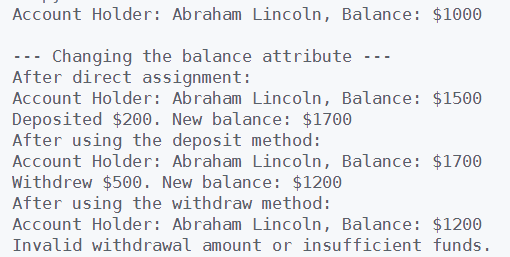

### Sample Output

---
### Your BankAccount Class

- Define a new class named `BankAccount`
- Add to the top of the class a docstring that reads: `A simple class that models a bank account.`
---

## Defining Your Methods

Define the following methods in your `BankAccount` class:

### 1. `__init__` Method
**Purpose:** Initialize the account holder's name and balance.

**Instructions:**
1. Define the `__init__` method with parameters `self`, `account_holder`, and `balance` (set default value of `balance` to 0).
2. Inside the method, set `self.account_holder` to `account_holder`.
3. Set `self.balance` to `balance`.

### 2. `deposit` Method
**Purpose:** Deposit money into the account.

**Instructions:**
1. Define the `deposit` method with parameters `self` and `amount`.
2. Inside the method, check if `amount` is greater than 0.
3. If true, add `amount` to `self.balance`.
4. Use an f-string to print a message showing the deposited amount and the new balance.
5. If false, print an "Invalid deposit amount" message.

### 3. `withdraw` Method
**Purpose:** Withdraw money from the account.

**Instructions:**
1. Define the `withdraw` method with parameters `self` and `amount`.
2. Inside the method, check if `amount` is greater than 0 and less than or equal to `self.balance`.
3. If true, subtract `amount` from `self.balance`.
4. Use an f-string to print a message showing the amount withdrawn from the account and the updated account balance.
5. If false, print an "Invalid withdrawal amount or insufficient funds!" message.

### 4. `get_balance` Method
**Purpose:** Return the current balance of the account.

**Instructions:**
1. Define the `get_balance` method with the parameter `self`.
2. Inside the method, return `self.balance`.

### 5. `display_account_info` Method
**Purpose:** Display account holder and balance.

**Instructions:**
1. Define the `display_account_info` method with the parameter `self`.
2. Inside the method, use an f-string to print a message showing the account holder's name and the balance.

---

## Creating an Instance of the `BankAccount` Class

- Create an instance of your `BankAccount` class
- Make yourself the account holder
- Set a starting account balance of $1500
- Then display the initial account info by calling the `display_account_info()` method (see the screenshot at top of page)bl
- Change the balance of your account using the three techniques outlined in the directions
  - Through direct assignment
  - By using the `deposit()` (and then the `display_account_info()` method)
  - By using the `withdraw()` (and then the `display_account_info()` method)
- Also show what happens when you attempt to make an invalid withdraw from your account (using the `withdraw()` method)

---

